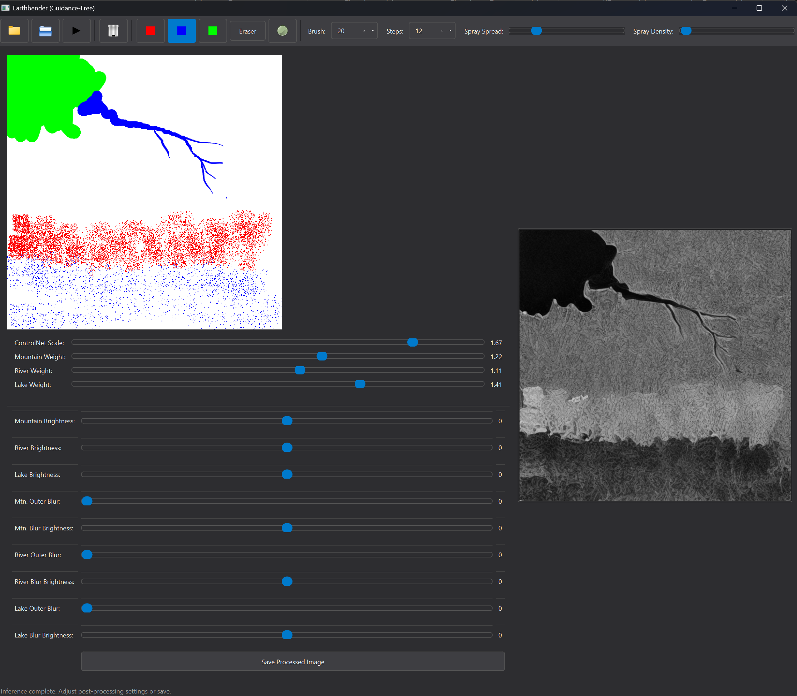
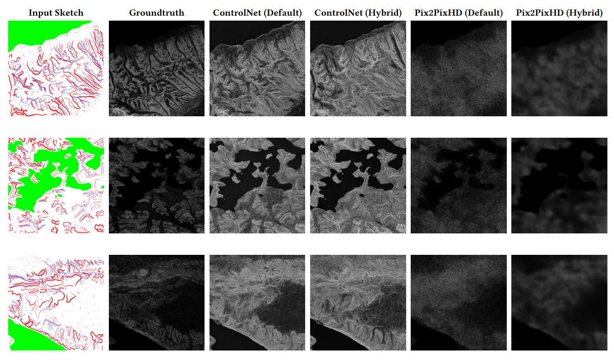

# Earthbender: An Interactive System for Stylistic Heightmap Generation

**MIG '25** | **University of Bremen**

This repository contains the official implementation of **Earthbender**, a sketch-conditioned diffusion framework for generating detailed 3D terrain heightmaps. The system allows users to sketch semantic features (mountains, rivers, lakes) and generates consistent heightmaps using a custom ControlNet architecture.



## 📂 File Structure

Here is an explanation of the core files included in this repository:

* **`guidancefree-gui-with3D.py`**
    * **What it is:** The main application for end-users.
    * **Function:** A PyQt6-based GUI that provides a canvas for sketching (Red=Mountains, Blue=Rivers, Green=Lakes). It runs the inference pipeline and includes a real-time **3D viewer** (via PyVista) to visualize the generated terrain.
* **`train_hybrid.py`**
    * **What it is:** The primary training script for the Earthbender model.
    * **Function:** Implements the proposed training method using a **Hybrid Loss** function (MSE + L1 + Smoothness) to ensure better structural coherence and artifact reduction compared to standard ControlNet training.
* **`train_default.py`**
    * **What it is:** The ablation study training script.
    * **Function:** Trains the model using the standard ControlNet loss (MSE only). Used for comparing the benefits of the hybrid loss function.
* **`evaluation.py`**
    * **What it is:** The quantitative evaluation script.
    * **Function:** Calculates metrics including PSNR, SSIM, LPIPS, FID, and KID to compare generated heightmaps against a ground truth dataset.

---

## 🛠️ Installation

Ensure you have Python 3.8+ installed. Install the required dependencies:

```bash
pip install torch torchvision diffusers accelerate
pip install opencv-python-headless scikit-image matplotlib
pip install PyQt6 pyvista qtpy
pip install lpips torch-fidelity  # For evaluation only
```

*Note: If using `bitsandbytes` for 8-bit Adam optimization during training, ensure it is compatible with your CUDA version.*

---

## 🚀 Usage

### 1. Running the GUI (Inference)
To launch the interactive painting and generation tool:

```bash
python guidancefree-gui-with3D.py
```
* **Usage:** Draw on the left canvas. Select your model directory using the toolbar folder icon. Click "Run Inference" to generate the heightmap. Use the "Show 3D Preview" button to inspect the terrain in 3D.

### 2. Training
To train the model using the proposed **Hybrid Loss**:

```bash
accelerate launch train_hybrid.py \
  --data_root ./path/to/dataset \
  --output_dir ./output_hybrid \
  --batch_size 4 \
  --lake_loss_weight 1
```

To train the baseline model (Standard Loss):
```bash
accelerate launch train_default.py \
  --data_root ./path/to/dataset \
  --output_dir ./output_baseline
```

### 3. Evaluation
To calculate metrics (PSNR, SSIM, LPIPS, FID, KID) comparing your generated results against ground truth:

```bash
python evaluation.py \
  --output_dir ./path/to/generated_images \
  --gt_dir ./path/to/ground_truth_tiffs
```

---

## 📊 Results



*Qualitative comparison between our method (ControlNet Hybrid) and baselines. Our approach generates significantly more coherent mountain ridges and river beds.*

---

## ✏️ Citation

If you find this code useful for your research, please cite our MIG '25 paper:

```bibtex
@inproceedings{BarazandehEarthbender,
author = {Barazandeh, Danial and Zachmann, Gabriel},
title = {Earthbender: An Interactive System for Stylistic Heightmap Generation using a Guided Diffusion Model},
year = {2025},
isbn = {9798400722363},
publisher = {Association for Computing Machinery},
address = {New York, NY, USA},
url = {https://doi.org/10.1145/3769047.3769053},
doi = {10.1145/3769047.3769053},
abstract = {Games, 3D simulations, and cinematic pipelines depend on realistic 3D terrain for immersion. However, creating detailed 3D terrain is labour-intensive: artists sculpt elevation, iterate on mountains, rivers, lakes, and must often repeat the entire workflow when the design changes. Recent generative approaches are attempting to address this challenge, but they primarily focus on a single landform (typically mountains) and overlook structural features, such as river networks, roads, or lakes.We propose a sketch‑conditioned diffusion framework that generates depth maps representing complete landscapes, including mountains, river networks, and lakes. Our method extends Stable Diffusion with a ControlNet branch that takes multiple channel inputs: Canny edges for overall structure, red for mountains, green for lakes, and blue as a carving tool for painting roads and rivers onto the heightmap.This approach addresses the technical challenges while prioritizing the artist’s creative control. Our interactive system, Earthbender, gives the artist fine-grained control over every detail in the heightmap, demonstrating a collaborative model where the generative AI acts as a powerful assistant to achieve an artistic vision, rather than replacing the artist’s creativity.Our experiments show that our ControlNet-based approach significantly outperforms traditional GANs in both data efficiency and output quality. Furthermore, we present an analysis demonstrating that the choice of loss function acts as a powerful artistic control, allowing the user to select between a sharp, detailed style and a softer, more organic output better suited for downstream game engine workflows.},
booktitle = {Proceedings of the 2025 18th ACM SIGGRAPH Conference on Motion, Interaction, and Games},
articleno = {6},
numpages = {11},
keywords = {Interactive Systems, Sketch-Based Modeling, Terrain Generation, ControlNet, Generative Models, Diffusion Models},
location = {
},
series = {MIG '25}
}
```

## Acknowledgments
This work was partially supported by a stipend from the University of Bremen.